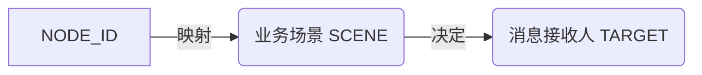

# 流程提醒配置原理解析

本文档解释了如何将流程图设计中的 `NODE_ID` 映射到真实的 **业务场景**，以及基于场景确定**消息接收人**的逻辑。

## 1. 核心原理：节点 -> 场景 -> 接收人

我们采用三层映射模型，将底层的技术 ID 转换为业务可理解的场景和责任人。



### 1.1 第一层：流程节点配置 (Static)

首先，我们明确流程图中各节点的定义（来自 `1.json`）。

| NODE_ID | 节点名称 | 
|---------|----------|
| `5ca31762...` | 发起 |
| `700f1822...` | 复核需求 |
| `8fd38299...` | 待提交部门领导审批 |
| `12b2feeb...` | 相关部门审批 |
| `df2b12a6...` | 待提交公司领导审批 |
| `f99fb340...` | 公司领导审批 |
| `91dc4ec0...` | 办结 |

### 1.2 第二层：业务场景映射 (Scene Mapping)

根据需求，我们将节点归类为三大场景：

| 业务场景 | 包含节点 | 含义 |
|---------|----------|------|
| **提交部门审批前** | 发起<br>复核需求 | 流程刚启动，尚未提交给部门领导。 |
| **提交审批中** | 待提交部门领导审批<br>待提交公司领导审批 | 关键节点。流程卡在“提交”动作上，**通常是经办人需要准备材料并点击提交**。 |
| **审批中/其他** | 相关部门审批<br>公司领导审批<br>办结 | 流程已提交，正在等待领导或相关部门审批。 |

### 1.3 第三层：接收人策略 (Recipient Logic)

不同的场景决定了谁是“当前责任人”。虽然数据库系统都会记录 `PARTAKE_USER`（当前待办人），但其业务角色含义不同。

- **早期待办 (提交审批前)**: 接收人是**产品经理/经办人**。提醒他们尽快完善信息。
- **关键提交点 (提交审批中)**: 接收人依然是**经办人**。此时任务通常是 "Check & Submit"。
- **正式审批 (审批中)**: 接收人是**审批领导**。提醒领导尽快审批。

## 2. SQL 实现逻辑

在 `发行审批提醒.sql` 中，我们通过扩展 `issue_node_cfg` CTE 来实现这一逻辑。

### 2.1 扩展配置表

我们在 CTE 中增加 `SCENE_CODE` 和 `SCENE_NAME` 字段：

```sql
issue_node_cfg as (
    -- 场景1: 提交部门审批前
    select '5ca3...' as NODE_ID, '发起' as NODE_NAME, 'PRE_DEPT_APPR' as SCENE_CODE, '流程未过提交部门审批节点' as SCENE_NAME
    union all select '700f...', '复核需求', 'PRE_DEPT_APPR', '流程未过提交部门审批节点'
    
    -- 场景2: 提交审批中 (关键卡点)
    union all select '8fd3...', '待提交部门领导审批', 'WAIT_SUBMIT', '流程在提交部门审批节点或提交公司审批节点'
    union all select 'df2b...', '待提交公司领导审批', 'WAIT_SUBMIT', '流程在提交部门审批节点或提交公司审批节点'
    
    -- 场景3: 其他情况
    union all select '12b2...', '相关部门审批', 'OTHERS', '其他情况'
    union all select 'f99f...', '公司领导审批', 'OTHERS', '其他情况'
    ...
)
```

### 2.2 生成告警内容

在最终查询时，利用 `SCENE_NAME` 生成更准确的提示语，并明确接收人及其角色。

```sql
select 
    ct.account as RECEIVER_ID, -- 接收人ID
    ic.SCENE_NAME,             -- 当前场景
    case 
        when ic.SCENE_CODE in ('PRE_DEPT_APPR', 'WAIT_SUBMIT') then '请经办人尽快处理/提交'
        else '请领导/审批人尽快审批'
    end as ACTION_TIP
    ...
```

通过这种方式，我们不仅告诉用户“你有个待办”，还能告诉他“现在处于什么阶段，期望你做什么”。


Node 节点的获取与判定逻辑可以概括为：从流程引擎配置表中提取原始流程定义，通过解析 JSON 结构识别任务节点，最后根据业务规则进行归类。

具体的获取逻辑如下：

1. 数据库读取逻辑 (Fetch)
流程的“设计图”是以 JSON 格式存储在数据库中的。

目标表：SYS_WF_TEMPLATE (流程模板表)。
核心字段：CFG_JSON。这个字段存储了整个流程图的所有节点（Node）、连线（Line）以及每个节点的配置参数。
查询方式：
sql
SELECT TMPL_NAME, CFG_JSON 
FROM SYS_WF_TEMPLATE 
WHERE TMPL_NAME = 'HXLC_产品发行审批'; -- 根据具体流程模板名称过滤
2. 解析逻辑 (Parse)
获取到 CFG_JSON 字符串后，通过程序（如 Python 或 Java）进行反序列化解析：

进入 Nodes 数组：解析 JSON 对象中的 
nodes
 列表。
过滤节点类型：只提取 type 为 "task" 的节点（忽略 start 开始节点、finished 办结节点或 visual 装饰节点）。
提取核心属性：
id: 对应流程引擎底层的 NODE_ID（如 5ca31762...）。
text 或 parameters.taskName: 对应节点在 UI 上显示的名称（如 发起、复核需求）。
3. 判断与归类逻辑 (Judge)
在解析出所有的 
(ID, Name)
 键值对后，根据业务阶段将它们映射到不同的场景（Scene）：

规则 A (起始阶段)：如果节点名是“发起”、“复核”等初期动作，判定为 PRE_DEPT_APPR (提交部门审批前)。
规则 B (关键卡点)：如果节点涉及到“待提交”、“重新处理”等需要经办人点击“提交”的操作，判定为 WAIT_SUBMIT (通常是流程停滞在经办人手里的关键提醒点)。
规则 C (审批阶段)：如果节点名包含“审批”、“领导”、“会签”等，判定为 OTHERS (审批中)，负责提醒对应的领导。
逻辑流总结 (Workflow)
DB: SYS_WF_TEMPLATE -> CFG_JSON (String)
Parser: JSON.parse -> List<Node> where type == 'task'
Mapper: Node.taskName + Business Rules -> Scene_Code
Final: 生成用于 SQL 或系统的 NODE_ID 映射关系，从而精准锁定谁该收到告警。